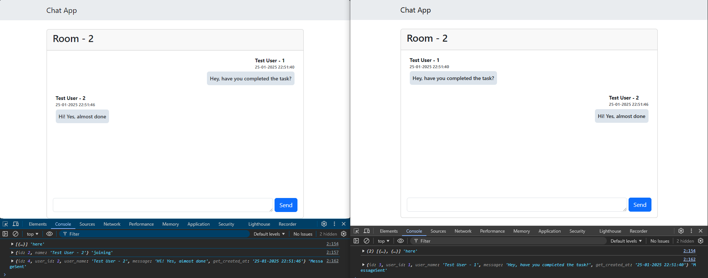

## Laravel Reverb Chat App

This project is a simple real-time chat application developed using Laravel Reverb. Users can join specific conversation rooms and communicate with others in real-time. The project leverages WebSocket technology to provide a fast and instant messaging experience.
- Users can join conversation rooms.
- Real-time messaging.
- "is typing..." indicator to show typing status.
- WebSocket integration with Larav-el Echo and Laravel Reverb.



## Setup

### 1. Clone

```sh
git clone https://github.com/MertMustehlik/laravel-reverb-chat-app.git
```

```sh
cd laravel-reverb-chat-app
```

### 2. Copy .env file

```sh
cp .env.example .env
```

### 3. Install dependencies

```sh
composer install
```

```sh
npm install
```

### 4. Generate application key

```sh
php artisan key:generate
```

### 5. Run migrations and seed database

```sh
php artisan migrate --seed
```

### 6. Start the server

```sh
php artisan serve
```

### 7. Start queue

```sh
php artisan queue:listen
```

### 8. Start reverb

```sh
php artisan reverb:start
```

### 9. Compile and start the frontend assets

```sh
npm run dev
```
